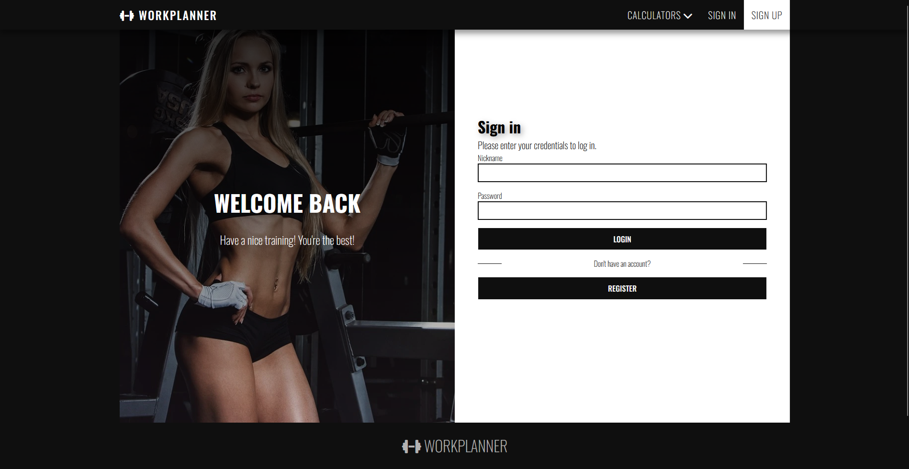
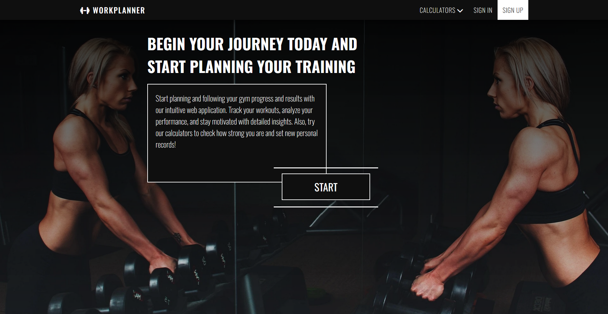

# WorkPlanner / GymForge 🏋🏽🔥💪🏼

A website designed to help you track your workouts and monitor your progress.  
Additionally, it provides calculators for assessing your strength and performance, including **Wilks, one-rep max, and weightlifting standards**.

## Features:

- Save and track your workouts 🏋️‍♂️📈
- Analyze progress with statistics 📊🔥
- Utilize strength calculators🔢
- Plan and manage training routines 📅📝

## Current sample look of my website

(The view may change during the development process of this website)

### Login Panel

### Welcome Panel

## Pages To-Do:

- [x] Navbar
- [x] Welcome
- [x] Login
- [x] Register
- [x] One-Rep Max Calculator
- [x] Wilks Calculator
- [x] Profile
- [ ] Weightlifting Standards
- [x] Dashboard - Side nav
- [ ] Dashboard - Welcome
- [ ] Dashboard - Statistics
- [ ] Dashboard - Training

## Backend Todo

- [x] Accounts - registration
- [x] Accounts - login
- [ ] Profile edit
- [ ] Traning plans - add new traning plans
- [ ] Completing trainings

## AI tools to add

- Ask an LLM to review the training plan created by a user

Stay tuned for updates! 🔥💪🏼
