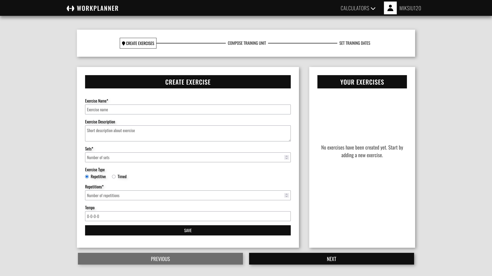

# GymForge / WorkPlanner

GymForge is a workout planning application built with Angular 19, ASP.NET Core 9 and PostgreSQL. It lets users create accounts, use strength calculators, compose custom training plans and review scheduled sessions.

## Features

- registration, login and JWT-based authorization,
- three-step custom training plan creator,
- repetitive and timed exercises with sets, repetitions, duration and tempo,
- reusable exercise selection for multiple training units,
- date range and individual session scheduling,
- saved plan library in the training dashboard,
- Wilks and one-rep-max calculators,
- responsive interface consistent with the existing monochrome GymForge design.

## Run with Docker

Requirements: Docker Desktop with Docker Compose.

1. Copy `.env.example` to `.env` and change the database password and JWT key.
2. Start the complete environment:

   ```bash
   docker compose up --build
   ```

3. Open `http://localhost:4200`.

Docker seeds an idempotent demo account on first start:

- nickname: `demo`
- password: `GymForge123!`

The account contains a two-week plan with a completed session, an overdue session,
today's session and an upcoming session. Set `SEED_DATA=false` in `.env` to disable
demo data.

The stack contains:

- `frontend` — Angular production build served by Nginx,
- `backend` — ASP.NET Core API available through the frontend under `/api`,
- `database` — PostgreSQL with a persistent `postgres_data` volume.

Database migrations are applied automatically when the backend container starts. To stop the application, run `docker compose down`. Add `-v` only when you intentionally want to delete the database volume.

## Local development

Start PostgreSQL on port `9090`, then run:

```bash
dotnet run --project backend/WorkPlanner.csproj
cd frontend
npm ci
npm start
```

The Angular development server uses `http://localhost:5163/api` and runs at `http://localhost:4200`.

## Screenshots

### Login panel


### Welcome panel


### Exercise creator


